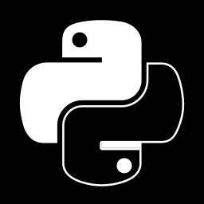

<strong class="mht" >Python Apps</strong> 
Hey dudes. W\*lcome [2]

 
 

\# Нужно было записать реальное перемещение мыши, 
   ориентируясь на скриншоты 
[> mouse_states_recorder](https://github.com/AleksandrovskyV/mouse_states_recorder)

\# Нужно было пожать директиву текстур, словно я танос \* 
[> vram_folder_crunch](https://github.com/AleksandrovskyV/vram_crunch)

\# Нужно было глянуть все иконки sidefx houdini разом 
[> svg_viewer](https://github.com/AleksandrovskyV/svg_viewer)

> Тут осенение, что qt\\tinker можно заменить сервером отдающим html, 
> а вслед осознание, как быстро забудешь эти хитросплетения из макарон...

 

<strong class="mht" >Python Utils</strong> 
Hey dudes. W\*lcome [3] > <a class="mhl" href="https://github.com/AleksandrovskyV/python/tree/main/utils">folder</a> or...

 
 

\# Нужно было собрать gif из секвенции больше 500 кадров 
[> pillow gif maker](https://github.com/AleksandrovskyV/python/blob/main/utils/pillow_gif_maker.py)

\# Нужно было переименовать секвенцию A_[####] > B_[####] 
[> batch_renamer](https://github.com/AleksandrovskyV/python/blob/main/utils/batch_renamer.py)

\# Нужно было добавить единый интерфейс запуска скриптов 
[> entry_run](https://github.com/AleksandrovskyV/python/blob/main/utils/entry_run.py)

> В общем если скачать папку и запускать через entry_run.bat 
> в windows будет интерфейс т.к. его обеспечит ./modules/tinker.py 

 

